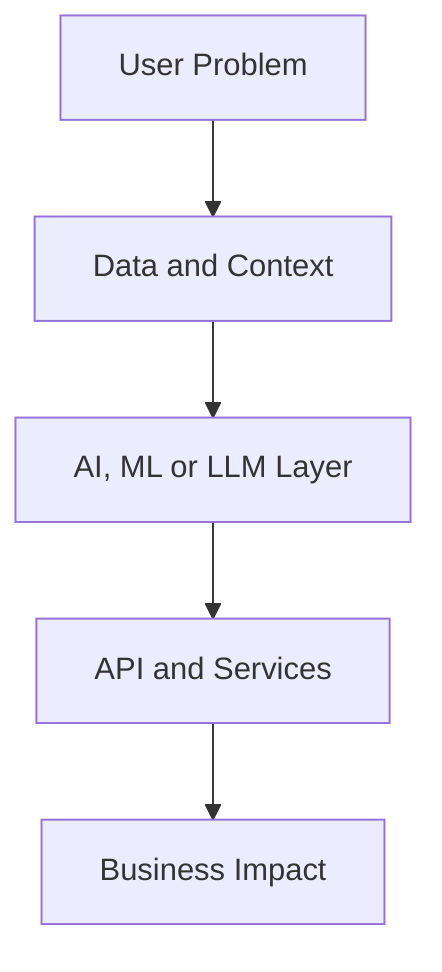
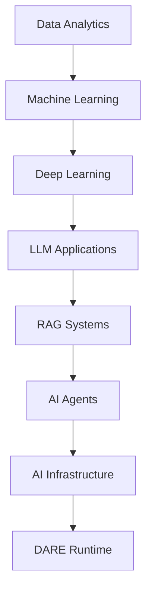

<div align="center">

# ⚡ Mohamed Nifras

### AI Engineer · Data Scientist · AI Systems Builder

**Building intelligent systems that transform business data into decisions.**

<p>
  <a href="https://github.com/Nifras7">
    
  </a>
  <a href="https://nifras.netlify.app/">
    
  </a>
  <a href="https://www.linkedin.com/in/mohamed-nifras-808117230/">
    
  </a>
  <a href="mailto:mohamednifras2808@gmail.com">
    
  </a>
</p>

</div>

---

## `> whoami`

```yaml
name: Mohamed Nifras
degree: B.Tech in Artificial Intelligence and Data Science
location: India

roles:
  - AI Engineer
  - Data Scientist
  - Data Analyst

focus:
  - Large Language Models
  - Retrieval-Augmented Generation
  - AI Infrastructure
  - Data Engineering
  - Intelligent Business Systems

mission: Build practical AI products that solve real-world problems.
````

---

## `> system_status`

| Field               | Current status                          |
| ------------------- | --------------------------------------- |
| **Status**          | 🟢 Building                             |
| **Current project** | DARE Runtime Engine                     |
| **Primary focus**   | AI Infrastructure and LLM Systems       |
| **Exploring**       | CUDA, AI Agents and Distributed Systems |
| **Availability**    | Open to AI and Data opportunities       |

---

## `> featured_projects`

### 🧠 DARE Runtime Engine

A conceptual adaptive runtime designed to profile AI workloads and select the most suitable execution device.

**Core pipeline**

`AI Workload → Profiler → Decision Engine → CPU / GPU / NPU`

**Key areas**

* Heterogeneous computing
* Runtime optimisation
* Hardware-aware scheduling
* AI infrastructure

[View project documentation](https://github.com/Nifras7?tab=repositories)

---

### 🛒 AI Retail Analytics

An AI-powered analytics platform for exploring sales, customer and inventory data using natural-language queries.

**Pipeline**

`Retail Data → SQL → LangChain → LLM → Dashboard`

**Features**

* Natural-language analytics
* KPI dashboards
* AI-generated business insights
* Sales forecasting

[View repository](https://github.com/Nifras7/AI_Powered_Retail_Analytics)

---

### 🤖 AI Hiring Assistant

A resume-analysis platform that compares candidate profiles with job descriptions using embeddings and semantic search.

**Pipeline**

`Resume → Embeddings → FAISS → Retriever → LLM`

**Features**

* Resume parsing
* Candidate scoring
* Skill-gap analysis
* Job-description matching

[View repository](https://github.com/Nifras7/AI-hiring-Assistant)

---

### 📈 Sales Forecasting

A machine-learning pipeline for predicting future sales using historical data and time-based features.

**Pipeline**

`Historical Data → Feature Engineering → ML Model → Forecast`

**Features**

* Lag-based feature engineering
* Demand prediction
* Trend analysis
* Business visualisations

[View repository](https://github.com/Nifras7/Sales_Forecasting)

---

### 👥 Customer Behaviour Analysis

A retail analytics project focused on customer segmentation, purchasing patterns and business performance.

**Technology**

`Python · SQL · Pandas · Power BI`

**Outcomes**

* Customer segmentation
* Retention insights
* KPI reporting
* Purchasing-pattern analysis

[View repository](https://github.com/Nifras7/Customer_Behavior_Analysis)

---

### 💧 HydroSentry

An IoT-based intelligent water-management platform for monitoring consumption and controlling water flow.

**Pipeline**

`Flow Sensor → Arduino → ESP8266 → Firebase → Dashboard`

**Features**

* Real-time water monitoring
* Usage-limit tracking
* Automated valve control
* Cloud data logging

[Explore all repositories](https://github.com/Nifras7?tab=repositories)

---

## `> technical_stack`

### Artificial Intelligence


### Engineering and Backend


### Data and Cloud


---

## `> architecture_mindset`



---

## `> current_research`

* AI Infrastructure
* Heterogeneous Computing
* Large Language Model Systems
* Retrieval-Augmented Generation
* Agentic AI
* Distributed Systems
* Runtime Optimisation
* AI for Business Intelligence

---

## `> development_journey`



---

## `> engineering_principles`

> Build for a real problem.
> Design before implementation.
> Measure before optimisation.
> Document important decisions.
> Prefer useful systems over impressive demos.
> Use AI to amplify human decision-making.

---

## `> current_direction`

| Area                | Current level      |
| ------------------- | ------------------ |
| AI Applications     | Advanced           |
| Machine Learning    | Advanced           |
| LLM and RAG Systems | Strong             |
| Data Engineering    | Strong             |
| Cloud Architecture  | Developing         |
| AI Infrastructure   | Actively exploring |

---

## `> vision`

> Build intelligent software that helps businesses understand data, automate decisions and operate more efficiently.

My long-term goal is to create practical AI products that combine strong engineering, useful analytics and measurable business value.

---

<div align="center">

### Building intelligent systems that create real-world impact.

[Explore Projects](https://github.com/Nifras7?tab=repositories) ·
[View Portfolio](https://nifras.netlify.app/) ·
[Connect on LinkedIn](https://www.linkedin.com/in/mohamed-nifras-808117230/)

</div>
```
