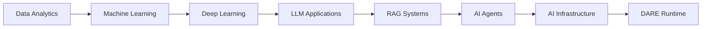

<div align="center">

# ⚡ Mohamed Nifras

### AI Engineer · Data Scientist · AI Systems Builder

**Building intelligent systems that transform business data into decisions.**

[](https://github.com/Nifras7)
[](https://nifras.netlify.app/)
[](https://www.linkedin.com/in/mohamed-nifras-808117230/)
[](mailto:mohamednifras2808@gmail.com)

</div>

---

## `> whoami`

```yaml
name: Mohamed Nifras
degree: B.Tech in Artificial Intelligence and Data Science
location: India

roles:
  - AI Engineer
  - Data Scientist
  - Data Analyst

focus:
  - Large Language Models
  - Retrieval-Augmented Generation
  - AI Infrastructure
  - Data Engineering
  - Intelligent Business Systems

mission: Build practical AI products that solve real-world problems.
```

---

## `> system_status`

```text
╭──────────────────────────────────────────────────────╮
│ STATUS        ● BUILDING                             │
│                                                      │
│ CURRENT       DARE Runtime Engine                    │
│ FOCUS         AI Infrastructure and LLM Systems      │
│ EXPLORING     CUDA · Agents · Distributed Systems    │
│ AVAILABLE     AI and Data Opportunities              │
╰──────────────────────────────────────────────────────╯
```

---

## `> featured_projects`

<table>
<tr>
<td width="50%" valign="top">

### 🧠 DARE Runtime Engine

A conceptual adaptive runtime that profiles AI workloads and selects the most suitable execution device.

**Core idea**

`Workload → Profiler → Decision Engine → CPU / GPU / NPU`

**Focus**

* Heterogeneous computing
* Runtime optimization
* Hardware-aware scheduling
* AI infrastructure

[View repository](YOUR_DARE_REPOSITORY_URL)

</td>

<td width="50%" valign="top">

### 🛒 AI Retail Analytics

An AI-powered analytics platform for exploring sales, customer, and inventory data using natural-language queries.

**Pipeline**

`Retail Data → SQL → LangChain → LLM → Dashboard`

**Features**

* Natural-language analytics
* KPI dashboards
* AI-generated insights
* Sales forecasting

[View repository](https://github.com/Nifras7/AI_Powered_Retail_Analytics)

</td>
</tr>

<tr>
<td width="50%" valign="top">

### 🤖 AI Hiring Assistant

A resume-analysis platform that compares candidate profiles with job descriptions using embeddings and semantic search.

**Pipeline**

`Resume → Embeddings → FAISS → Retriever → LLM`

**Features**

* Resume parsing
* Skill-gap analysis
* Candidate scoring
* Job-description matching

[View repository](https://github.com/Nifras7/AI-hiring-Assistant)

</td>

<td width="50%" valign="top">

### 📈 Sales Forecasting

A machine-learning pipeline for predicting future sales using historical data and time-based features.

**Pipeline**

`Historical Data → Feature Engineering → Model → Forecast`

**Features**

* Lag-based features
* Trend analysis
* Demand prediction
* Business visualizations

[View repository](https://github.com/Nifras7/Sales_Forecasting)

</td>
</tr>

<tr>
<td width="50%" valign="top">

### 👥 Customer Behaviour Analysis

A retail analytics project focused on customer segmentation, purchasing patterns, and business performance.

**Tools**

`Python · SQL · Power BI · Pandas`

**Outcomes**

* Customer segmentation
* Retention insights
* KPI analysis
* Purchasing-pattern discovery

[View repository](https://github.com/Nifras7/Customer_Behavior_Analysis)

</td>

<td width="50%" valign="top">

### 💧 HydroSentry

An IoT-based intelligent water-management platform for monitoring consumption and controlling water flow.

**Pipeline**

`Flow Sensor → Arduino → ESP8266 → Firebase → Dashboard`

**Features**

* Real-time monitoring
* Usage-limit tracking
* Automated valve control
* Cloud data logging

[Explore my repositories](https://github.com/Nifras7?tab=repositories)

</td>
</tr>
</table>

---

## `> technical_stack`

### Artificial Intelligence


### Engineering and Backend


### Data and Cloud


---

## `> architecture_mindset`

```text
                    ┌──────────────────┐
                    │   User Problem   │
                    └────────┬─────────┘
                             │
                             ▼
                    ┌──────────────────┐
                    │ Data and Context │
                    └────────┬─────────┘
                             │
                             ▼
              ┌──────────────────────────────┐
              │ AI / ML / LLM Decision Layer │
              └──────────────┬───────────────┘
                             │
                             ▼
                    ┌──────────────────┐
                    │ API and Services │
                    └────────┬─────────┘
                             │
                             ▼
                    ┌──────────────────┐
                    │ Business Impact  │
                    └──────────────────┘
```

---

## `> current_research`

```text
01  AI Infrastructure
02  Heterogeneous Computing
03  Large Language Model Systems
04  Retrieval-Augmented Generation
05  Agentic AI
06  Distributed Systems
07  Runtime Optimization
08  AI for Business Intelligence
```

---

## `> development_journey`




## `> engineering_principles`

```text
Build for a real problem.
Design before implementation.
Measure before optimization.
Document every important decision.
Prefer working systems over impressive demos.
Use AI to amplify human decision-making.
```

---

## `> current_direction`

```text
AI Applications          ███████████████████░  95%
Machine Learning         ██████████████████░░  90%
Data Engineering         ████████████████░░░░  80%
LLM and RAG Systems      █████████████████░░░  85%
Cloud Architecture       ██████████████░░░░░░  70%
AI Infrastructure        ████████████░░░░░░░░  60%
```

---

## `> vision`

> Build intelligent software that helps businesses understand data, automate decisions, and operate more efficiently.

My long-term goal is to create practical AI products that combine strong engineering, useful analytics, and measurable business value.

---

<div align="center">

### Let us build intelligent systems that create real-world impact.

[Explore Projects](https://github.com/Nifras7?tab=repositories) · [View Portfolio](https://nifras.netlify.app/) · [Connect on LinkedIn](https://www.linkedin.com/in/mohamed-nifras-808117230/)

</div>
